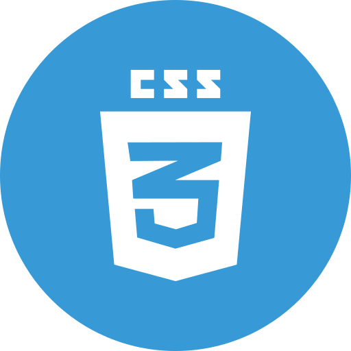
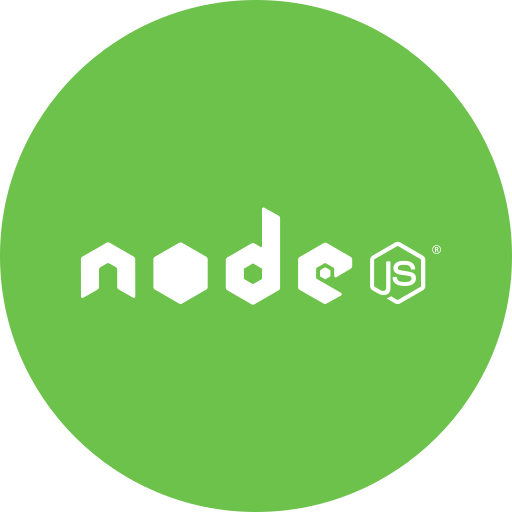

<!-- banner image starts here  -->

<!-- banner image ends here  -->

<h1> 👋 Hello, I'm Abir Hasan </h1>

Front-end and Ui/Ux developer 
🏠 &nbsp; Living: Dhaka, Bangladesh

<!-- Contact me section starts here  -->

[][website]
[]
[][facebook]
[][linkedin]  

 

<!-- Contact me section ends here  -->

<!-- about-me section starts here  -->

### 👨‍🏫 &nbsp; About Me

I am a Frontend developer work with mostly Reactjs , Nodejs and Expressjs. Also expert on figma and Adobe suit to improve Ui/Ux .  
Now i am learning on MongoDB and rest API cause my nxet perpose as a MERN stack developer,to create a bug free application system  
i'm also learning Selenium and Ranorex tester for code testing.

 
<!-- about-me section ends here  -->

<!-- web related skills section starts here  -->

### 👨🏽‍💻 &nbsp; My Skills :

#### Key Skills on Web development:

[]
[]
[]
[]
[]
[]
[]
[]
[]
[]
[]
[]

   

<!-- web related skills section ends here  -->

    
   

###  Other Skills :

[]
[]
[]

 

- Figma
- Adobe suit
- scratch 
- MS Word
- MS Excel
- MS powerpoint
- Wondare Share flim-mora
  <!-- other skills and my videos for computer science section ends here  -->

   

 

<!-- github stats ends here  -->
 

<!-- other skills and my videos for computer science section starts here  -->

<!-- work experience section starts here  -->

### 💼 &nbsp; Employment History

| Position                     | Institute                                   | Duration            | Location           |
| -------------------          | ------------------------------------------- | ------------------- | ------------------ |
| Front-end Developer          | codeboxr                                    | May 2022 - Running  | Dhaka, Bangladesh  |
| Front-end Developer(Intern)  | Sbit                                        | Nov 2021 - Feb 2022 | Dhaka, Bangladesh  |
| Digital Marketing Executive  | Shampratik Deshkal                          | Mar 2020 - Oct 2021 | Dhaka, Bangladesh  |
| Data Entry Operator          | Unitech Engineering                         | Nov 2015 - Jan 2016 | Dhaka, Bangladesh  |
| Sales Associated             | Aarong                                      | May 2016 - Jul 2016 | Dhaka, Bangladesh  |
| Content Creator              | YouTube                                     | Jan 2018- Running   | Dhaka, Bangladesh  |

 
<!-- work experience section ends here  -->
<!-- education section starts here  -->

### 👨🏻‍🎓 &nbsp; Education

1. B.Sc. in Computer Science & Engineering  
   Eastern University  
   Dhaka, Bangladesh.
3. Diploma in Computer Science & Technology  
   Feni Computer Institute  
   Feni Bangladesh

 

<!-- education section ends here  -->

<!-- my languages section starts here  -->

### Languages:

- 🇧🇩 Bangla : Native
- 🏴󠁧󠁢󠁥󠁮󠁧󠁿 English : Advanced
- 🇮🇳 Hindi : Intermediate

   

<!-- my languages section ends here  -->

<!-- my sports and game section starts here  -->

### Sports / Game / Activities / Hobby:

- 🏏 Cricket, ⚽ Football, 🏸 Badminton,  🏐 Volleyball
- 🏊‍♂️ Swimming, 🏃‍♂️ Running, 🚶‍♂️ Walking
- ✈️ Travelling

 
<!-- my sports and games section ends here  -->

<!-- Honors & awards section starts here  -->

### 🏅 Honors & Awards :

- Awards from Suvastu Engineering for Logo Competition.
- Honor from Time Corner for Digital Marketing and logo create.

---

Thanks for going through my Portfolio.
All rights reserved by Anisul Islam @2021

---

<!-- my achievement section ends here  -->

<!-- Links section starts here -->

[website]: http://www.facebook.com/abir.fci/
[youtube]: https://www.youtube.com/c/anisulislamrubel
[facebook]: https://www.facebook.com/abir.fci/
[linkedin]: https://www.linkedin.com/in/abir-hasan-432458135/
[github]: https://github.com/anisul-Islam

<!-- web related playlists starts here  -->
[fullstackplaylist]: https://youtube.com/playlist?list=PLgH5QX0i9K3p06YY1fyReA2UK8mh_zsiY
[htmlplaylist]: https://youtube.com/playlist?list=PLgH5QX0i9K3oHBr5dsumGwjUxByN5Lnw3
[cssplaylist]: https://youtube.com/playlist?list=PLgH5QX0i9K3qjCBXjTmv7Xeh8MDUUVJDO
[bootstrapplaylist]: https://youtube.com/playlist?list=PLgH5QX0i9K3oC_wmWEZa2xWxJauIRQ9kG
[javascriptplaylist]: https://www.youtube.com/playlist?list=PLgH5QX0i9K3qzryglMjcyEktz4q7ySunX
[jsonplaylist]: https://www.youtube.com/playlist?list=PLgH5QX0i9K3rWYYIcCykektDcb_1IPDz4
[sassplaylist]: https://www.youtube.com/playlist?list=PLgH5QX0i9K3qOvGYtFb3Z7KVMLrijYdqO
[jqueryplaylist]: https://www.youtube.com/playlist?list=PLgH5QX0i9K3pSJG9Hwjnykd0hLGEsW4DB
[reactplaylist]: https://youtube.com/playlist?list=PLgH5QX0i9K3rGtitufynBKMy5gAFpa1y8
[nodeandexpressplaylist]: https://www.youtube.com/playlist?list=PLgH5QX0i9K3r6ZGeyFnSv_YDxVON2P85m
[mongodbplaylist]: https://www.youtube.com/playlist?list=PLgH5QX0i9K3r6ZGeyFnSv_YDxVON2P85m
[mysqlplaylist]: https://www.youtube.com/playlist?list=PLgH5QX0i9K3qLcx9DvVDWmNJ7riPvxzCD
[githubplaylist]: https://www.youtube.com/playlist?list=PLgH5QX0i9K3r6ZGeyFnSv_YDxVON2P85m

<!-- web related playlists ends here  -->

<!-- cse related playlists starts here  -->
[cplaylist]: https://youtube.com/playlist?list=PLgH5QX0i9K3pCMBZcul1fta6UivHDbXvz
[cplusplaylist]: https://youtube.com/playlist?list=PLgH5QX0i9K3q0ZKeXtF--CZ0PdH1sSbYL
[javaplaylist]: https://youtube.com/playlist?list=PLgH5QX0i9K3oAZUB2QXR-dZac0c9HNyRa
[androidplaylist]: https://youtube.com/playlist?list=PLgH5QX0i9K3p9xzYLFGdfYliIRBLVDRV5
[pythonplaylist]: https://youtube.com/playlist?list=PLgH5QX0i9K3rz5XqMsTk41_j15_6682BN
[aienglishplaylist]: https://www.youtube.com/playlist?list=PLgH5QX0i9K3rRVV7oeML93OVAxqQ-CvzV
[aibanglaplaylist]: https://youtube.com/playlist?list=PLgH5QX0i9K3oFAaeJxjDWA8kEbMutzV6V
[javaswingplaylist]: https://www.youtube.com/playlist?list=PLgH5QX0i9K3rAHKr6IteF5kdgN6BorH9l
[numericalplaylist]: https://youtube.com/playlist?list=PLgH5QX0i9K3oKFrSOo4Kwns1-vTZmKQ7z
[operatingsystemplaylist]: https://youtube.com/playlist?list=PLgH5QX0i9K3r_SuT0AnOEoElfQQPgkBIq
[dsplaylist]: https://youtube.com/playlist?list=PLgH5QX0i9K3rYy9DVhk28m8enSo8xxiZ3
[tocplaylist]: https://youtube.com/playlist?list=PLgH5QX0i9K3qw5pu16QgnKNj91Rnjoyd0
[compilerplaylist]: https://youtube.com/playlist?list=PLgH5QX0i9K3oWTwTgILA7v9oysoDgkJDg
[networkingplaylist]: https://www.youtube.com/playlist?list=PLgH5QX0i9K3p5OI88r3ob-otmKqIm_DbS
[hscictplaylist]: https://www.youtube.com/playlist?list=PLgH5QX0i9K3o8Y-CKhmyodbfHAc9VSVOv
[learnforskillplaylist]: https://youtube.com/playlist?list=PLgH5QX0i9K3qyJVIaeHSqiRWOyO6HW023
[mswordplaylist]: https://www.youtube.com/playlist?list=PLgH5QX0i9K3p21lsneT3cW4CJL4Bd1lJ2
[mspowerpointplaylist]: https://youtube.com/playlist?list=PLgH5QX0i9K3pBnrckqfJ2zn7FL6Q_LNcm
[msexcelplaylist]: https://www.youtube.com/playlist?list=PLgH5QX0i9K3ohKCQMR7aopneByGX05iSK

<!-- cse related playlists ends here  -->

<!-- Links section ends here -->
